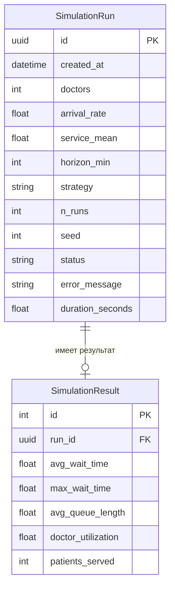

# ER-схема

## Сущности и связи (текстом)

**Прогон симуляции** (`SimulationRun`) — один запуск с заданными
параметрами больницы. (1) → **Результат симуляции** (`SimulationResult`)
(0 или 1): у только что созданного прогона результата ещё нет (расчёт
идёт в фоне, статус `queued`/`running`), он появляется, когда прогон
досчитан (`status = done`).

Имена полей `SimulationRun` совпадают с именами `HospitalParams` —
схемы параметров в `web/schemas.py` (см. "Работа 2: API", пункт 2) —
и с именами полей формы (`web/forms.py`), чтобы не плодить путаницу
между слоями.

## SimulationRun

| Поле | Тип | Описание |
|---|---|---|
| id | UUID, PK | первичный ключ (в API отдаётся как `task_id`) |
| created_at | datetime | момент создания |
| doctors | целое | количество врачей в отделении, 1..20 |
| arrival_rate | дробное | поток пациентов, чел/мин |
| service_mean | дробное | среднее время приёма одного пациента, мин |
| horizon_min | целое | длина смены, мин (по умолчанию 480 — 8 часов) |
| strategy | строка (choices) | fifo / priority / dynamic |
| n_runs | целое | сколько независимых прогонов усреднить, 1..1000 |
| seed | целое, nullable | зерно ГПСЧ (если не задано — подбирается и сохраняется автоматически) |
| status | строка (choices) | queued / running / done / failed |
| error_message | строка | текст исключения, если status = failed |
| duration_seconds | дробное, nullable | сколько реально считался прогон (фон + замер, galочка 7) |

## SimulationResult

| Поле | Тип | Описание |
|---|---|---|
| id | автоинкремент, PK | первичный ключ |
| run_id | UUID, FK → SimulationRun.id, unique | связь 1-к-1 с прогоном |
| avg_wait_time | дробное, nullable | среднее время ожидания, мин |
| max_wait_time | дробное, nullable | максимальное время ожидания, мин |
| avg_queue_length | дробное, nullable | средняя длина очереди (оценка по формуле Литтла) |
| doctor_utilization | дробное, nullable | загрузка врачей, 0..1 |
| patients_served | целое, nullable | сколько пациентов обслужили (в среднем за n_runs) |

## Где большие данные и почему они там

Во время одного прогона симулируются десятки/сотни виртуальных
пациентов на каждый из `n_runs` повторов, и для графика («длина
очереди во времени») получаются сотни/тысячи точек. **Эти сырые точки
НЕ хранятся построчно в БД** — таблица на тысячи строк на каждый
прогон быстро сделала бы SQLite неудобной, а сами точки нужны только
один раз, чтобы построить график сразу после расчёта.

Поэтому в БД (`SimulationResult`) хранятся только **агрегированные
числа** — средние, максимумы, доля обслуженных. Сырые точки для
графика (когда появятся) будут либо пересчитываться на лету из уже
готовых метрик, либо, если понадобится хранить именно кривую, — одним
JSON-полем в `SimulationResult`, а не отдельной строкой на каждую
точку.

## Диаграмма (Mermaid)

